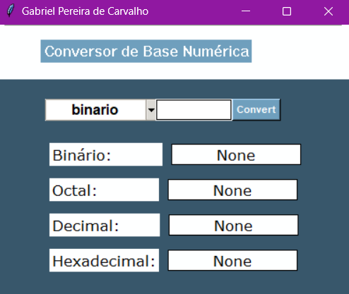

Conversor de Base Numérica

Este projeto é uma aplicação GUI (Interface Gráfica do Usuário) criada com Tkinter, uma biblioteca padrão do Python para criar interfaces gráficas. O objetivo do projeto é converter números entre diferentes bases numéricas: binário, octal, decimal e hexadecimal, porém com o intuito principal no aprendizagem de entender a utilização do tkinter.

